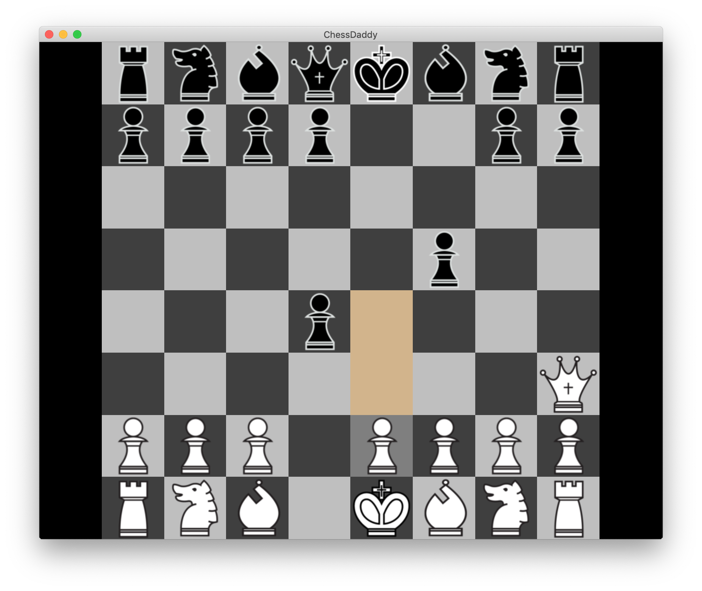

# ChessDaddy
Game of Chess

<h2>Features</h2>
<h3>Graphics</h3>
<ul>
  <li>Orthographic Camera</li>
  <li>Square FitViewport</li>
  <li>Gray Board Tiles</li>
</ul>

<h3>Current Game Mechanics</h3>
<ul>
  <li>Check :white_check_mark:</li>
  <li>Checkmate :white_check_mark:</li>
  <li>Stalemate :white_check_mark:</li>
  <li>Move History/Undo :x:</li>
  <li>Pawn
    <ul>
      <li>Movement :white_check_mark:</li>
      <li>Capturing :white_check_mark:</li>
      <li>En Passant :white_check_mark:</li>
      <li>Promotion :white_check_mark:</li>
    </ul>
  </li>
  <li>Kinght
    <ul>
      <li>Movement :white_check_mark:</li>
      <li>Capturing :white_check_mark:</li>
    </ul>
  </li>
  <li>Bishop
    <ul>
      <li>Movement :white_check_mark:</li>
      <li>Capturing :white_check_mark:</li>
    </ul>
  </li>
  <li>Rook
    <ul>
      <li>Movement :white_check_mark:</li>
      <li>Capturing :white_check_mark:</li>
    </ul>
  </li>
  <li>Queen
    <ul>
      <li>Movement :white_check_mark:</li>
      <li>Capturing :white_check_mark:</li>
    </ul>
  </li>
  <li>King
    <ul>
      <li>Movement :white_check_mark:</li>
      <li>Capturing :white_check_mark:</li>
      <li>Castling :white_check_mark:</li>
    </ul>
  </li>
  <li>Single Player AI :x:
    <ul>
      <li>Easy :x:</li>
      <li>Medium :x:</li>
      <li>Hard :x:</li>
    </ul>
  </li>
  <li>Two Player :white_check_mark:</li>
</ul>
